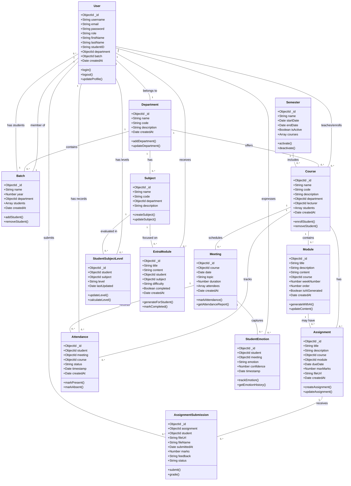
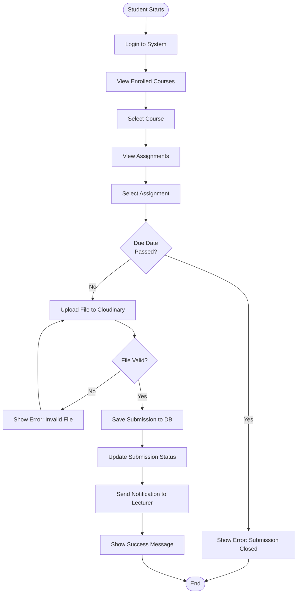
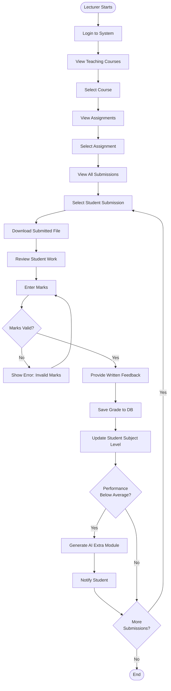
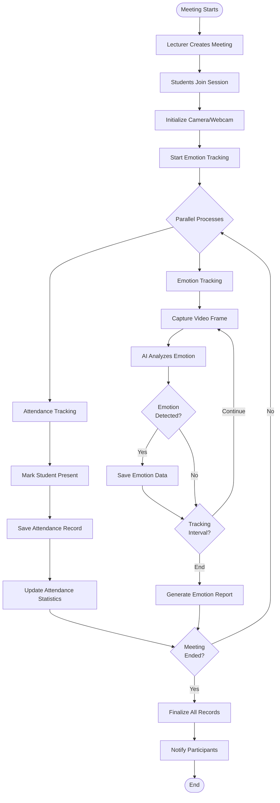
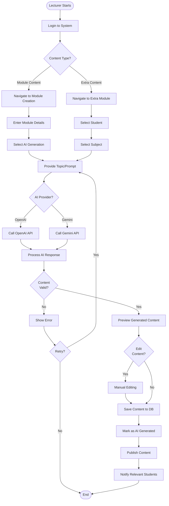
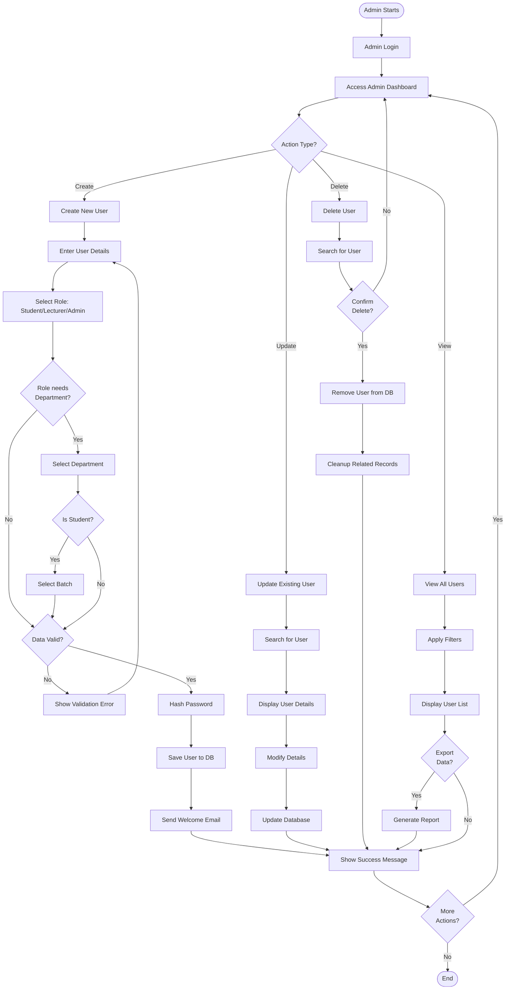

# Smart LMS - System Diagrams and Flow Documentation

## Table of Contents
1. [System Overview](#system-overview)
2. [Use Case Diagram](#use-case-diagram)
3. [Class Diagram](#class-diagram)
4. [Activity Diagrams](#activity-diagrams)
5. [System Flow Explanation](#system-flow-explanation)

---

## System Overview

The Smart LMS (Learning Management System) is an intelligent educational platform that supports multiple user roles including Students, Lecturers, and Administrators. The system features AI-powered content generation, emotion tracking, attendance management, and comprehensive assignment handling with file uploads via Cloudinary.

**Key Features:**
- User authentication and role-based access control
- Course and module management
- Assignment creation and submission with file uploads
- Real-time attendance tracking with emotion detection
- AI-powered content generation (using OpenAI/Gemini)
- Student performance analytics and subject level tracking
- Batch and semester management

---

## Use Case Diagram

```mermaid
graph TB
    Student((Student))
    Lecturer((Lecturer))
    Admin((Admin))
    
    subgraph "Smart LMS System"
        UC1[Login/Register]
        UC2[View Courses]
        UC3[Access Modules]
        UC4[Submit Assignment]
        UC5[Upload Files]
        UC6[View Grades]
        UC7[Track Attendance]
        UC8[Emotion Tracking]
        
        UC9[Create Course]
        UC10[Create Module]
        UC11[Create Assignment]
        UC12[Grade Submission]
        UC13[Mark Attendance]
        UC14[Generate AI Content]
        UC15[View Analytics]
        UC16[Schedule Meetings]
        
        UC17[Manage Users]
        UC18[Manage Departments]
        UC19[Manage Batches]
        UC20[Manage Semesters]
        UC21[View Statistics]
        UC22[Configure System]
    end
    
    %% Student Use Cases
    Student --> UC1
    Student --> UC2
    Student --> UC3
    Student --> UC4
    Student --> UC5
    Student --> UC6
    Student --> UC7
    Student --> UC8
    
    %% Lecturer Use Cases
    Lecturer --> UC1
    Lecturer --> UC2
    Lecturer --> UC9
    Lecturer --> UC10
    Lecturer --> UC11
    Lecturer --> UC12
    Lecturer --> UC13
    Lecturer --> UC14
    Lecturer --> UC15
    Lecturer --> UC16
    
    %% Admin Use Cases
    Admin --> UC1
    Admin --> UC17
    Admin --> UC18
    Admin --> UC19
    Admin --> UC20
    Admin --> UC21
    Admin --> UC22
    Admin --> UC9
    Admin --> UC10
```



### Use Case Descriptions

#### Student Use Cases
- **Login/Register**: Authenticate and access the system
- **View Courses**: Browse enrolled courses
- **Access Modules**: View learning materials and content
- **Submit Assignment**: Upload and submit assignments
- **Upload Files**: Upload documents via Cloudinary
- **View Grades**: Check assignment scores and feedback
- **Track Attendance**: View attendance records
- **Emotion Tracking**: System tracks student emotions during sessions

#### Lecturer Use Cases
- **Create Course**: Set up new courses
- **Create Module**: Add learning modules with content
- **Create Assignment**: Design assignments with due dates
- **Grade Submission**: Evaluate and grade student work
- **Mark Attendance**: Record student attendance
- **Generate AI Content**: Use AI to create educational content
- **View Analytics**: Monitor student performance
- **Schedule Meetings**: Organize class sessions

#### Admin Use Cases
- **Manage Users**: CRUD operations for all users
- **Manage Departments**: Organize academic departments
- **Manage Batches**: Control student batches
- **Manage Semesters**: Configure academic periods
- **View Statistics**: System-wide analytics
- **Configure System**: System settings and parameters

---

## Class Diagram



### Class Descriptions

**Core Entities:**
- **User**: Central entity representing Students, Lecturers, and Admins
- **Department**: Academic departments organizing courses and students
- **Batch**: Student groups by enrollment year
- **Course**: Academic courses with enrolled students
- **Module**: Learning content units within courses
- **Assignment**: Tasks assigned to students
- **AssignmentSubmission**: Student submissions with file uploads
- **Meeting**: Scheduled class sessions
- **Attendance**: Attendance records for meetings
- **StudentEmotion**: AI-tracked emotional states during sessions
- **StudentSubjectLevel**: Performance levels per subject
- **Semester**: Academic term management
- **Subject**: Academic subjects across departments
- **ExtraModule**: Personalized learning content for students

---

## Activity Diagrams

### 1. Student Assignment Submission Flow



### 2. Lecturer Grading Workflow



### 3. Attendance and Emotion Tracking Flow



### 4. AI Content Generation Flow



### 5. Admin User Management Flow



---

## System Flow Explanation

### 1. Authentication and Authorization Flow

The system implements JWT-based authentication with role-based access control:

1. **User Login**: User provides credentials (username/email and password)
2. **Authentication**: Backend validates credentials against MongoDB
3. **Token Generation**: JWT token is generated with user role and ID
4. **Authorization**: Each request includes JWT token in header
5. **Middleware Validation**: Auth middleware validates token and role
6. **Access Control**: Routes are protected based on user roles

**Roles Hierarchy:**
- **Admin**: Full system access, user management, system configuration
- **Lecturer**: Course management, grading, attendance, content creation
- **Student**: View courses, submit assignments, track progress

### 2. Assignment Submission and Grading Flow

**Student Perspective:**
1. Student logs in and navigates to enrolled courses
2. Selects course and views available assignments
3. Checks assignment details and due date
4. Uploads file (PDF, DOC, images) to Cloudinary
5. System validates file and saves submission with metadata
6. Submission status set to "submitted"
7. Lecturer receives notification

**Lecturer Perspective:**
1. Lecturer views course assignments
2. Checks all student submissions
3. Downloads submission files from Cloudinary
4. Reviews work and enters marks
5. Provides written feedback
6. System updates student's subject level
7. If performance is low, AI generates extra learning modules
8. Student receives grade notification

**Technical Flow:**
- Files uploaded via Cloudinary API
- Submission metadata stored in MongoDB
- Subject level service calculates performance
- AI service generates personalized content

### 3. Attendance and Emotion Tracking Flow

**Process:**
1. Lecturer creates meeting for course session
2. Students join meeting session
3. System initializes webcam/camera access
4. Parallel processes start:
   - **Attendance**: Student presence marked and recorded
   - **Emotion Tracking**: Video frames captured every 60 seconds (configurable)
5. Emotion AI analyzes facial expressions
6. Detected emotions (happy, sad, confused, focused, etc.) stored with timestamp
7. Meeting end triggers report generation
8. Analytics dashboard displays emotion trends

**Technical Implementation:**
- Face detection using TensorFlow.js models
- Emotion classification with pre-trained models
- Real-time data storage in MongoDB
- Configurable tracking interval via environment variable

### 4. AI Content Generation Flow

The system supports two AI providers (OpenAI and Gemini):

**Module Content Generation:**
1. Lecturer initiates module creation
2. Provides topic, subject, and learning objectives
3. Selects AI generation option
4. System calls configured AI provider (OpenAI/Gemini)
5. AI generates structured content with headings, explanations, examples
6. Lecturer reviews and can edit generated content
7. Content saved and marked as AI-generated
8. Published to enrolled students

**Extra Module Generation:**
1. System identifies struggling students (low subject level)
2. Automatically or manually triggers extra module generation
3. AI creates personalized content based on:
   - Student's current level
   - Subject difficulty
   - Previous performance
4. Content tailored to student's needs
5. Student notified of new learning material

**AI Service Architecture:**
- Provider selection via environment variable
- Fallback mechanism if primary provider fails
- Content validation and sanitization
- Rate limiting and error handling

### 5. Student Performance and Analytics Flow

**Data Collection:**
1. Assignment scores collected
2. Attendance records tracked
3. Emotion data aggregated
4. Subject-wise performance calculated

**Level Calculation:**
1. Student completes assignments
2. Marks recorded in system
3. Subject level service calculates average performance
4. Level assigned: Beginner, Intermediate, Advanced
5. Trends tracked over time

**Analytics Dashboard:**
1. Aggregates data from multiple sources
2. Generates visualizations:
   - Performance graphs
   - Attendance trends
   - Emotion distribution
   - Subject level progression
3. Provides insights for lecturers and admins
4. Identifies at-risk students

**Automated Interventions:**
- Low performance triggers extra module generation
- Poor attendance alerts admin/lecturer
- Negative emotion trends flag for attention

### 6. Course and Module Management Flow

**Course Creation:**
1. Admin/Lecturer creates course
2. Assigns department and lecturer
3. Sets course code, name, description
4. Enrolls students (manual or batch enrollment)

**Module Organization:**
1. Modules organized by week number and order
2. Each module contains:
   - Title and description
   - Content (text, code, examples)
   - Associated assignments
   - AI-generated flag
3. Sequential learning path maintained

**Assignment Integration:**
1. Assignments linked to specific modules
2. Due dates and max marks configured
3. Supporting files uploaded to Cloudinary
4. Submission tracking per student

### 7. File Upload and Storage Flow

**Cloudinary Integration:**
1. User selects file for upload
2. Frontend validates file type and size
3. File sent to backend API
4. Backend uploads to Cloudinary using API credentials
5. Cloudinary returns secure URL
6. URL stored in MongoDB with metadata
7. File accessible via signed URLs

**Supported Use Cases:**
- Assignment file uploads (PDF, DOC, images)
- Assignment submission files
- Course materials and resources
- User profile pictures

**Security:**
- Signed URLs with expiration
- File type validation
- Size limits enforced
- User authentication required

### 8. Batch and Semester Management Flow

**Batch Management:**
1. Admin creates batch with year and department
2. Students assigned to batches
3. Courses can target specific batches
4. Batch-wide operations supported

**Semester Management:**
1. Admin creates semester with date range
2. Courses assigned to active semester
3. Only one semester active at a time
4. Semester change triggers data archival

**Integration:**
- Attendance tracked per semester
- Performance analytics per semester
- Course offerings change per semester
- Historical data maintained

---

## Data Flow Summary

### Request-Response Cycle

```
Client (Angular) 
    ↓ HTTP Request + JWT
Backend (Express.js)
    ↓ Auth Middleware
Route Handler
    ↓ Business Logic
Service Layer (AI, Attendance, etc.)
    ↓ Database Operations
MongoDB
    ↓ Response Data
Service Layer
    ↓ Formatting
Route Handler
    ↓ JSON Response
Client (Angular)
    ↓ UI Update
User Interface
```

### External Service Integration

```
Backend
    ↓
Cloudinary API → File Storage
OpenAI/Gemini API → AI Content
MongoDB Atlas → Data Storage
Firebase (Legacy) → Other Services
```

---

## Technology Stack

**Frontend:**
- Angular 18+ with TypeScript
- Material Design UI components
- TensorFlow.js for emotion detection
- RxJS for reactive programming

**Backend:**
- Node.js with Express.js
- MongoDB with Mongoose ODM
- JWT for authentication
- Cloudinary SDK for file uploads
- OpenAI/Gemini API clients

**Infrastructure:**
- MongoDB Atlas (Cloud Database)
- Cloudinary (File Storage)
- Environment-based configuration

---

## Security Considerations

1. **Authentication**: JWT tokens with expiration
2. **Authorization**: Role-based access control middleware
3. **Data Validation**: Input sanitization and validation
4. **File Upload**: Type and size restrictions
5. **API Keys**: Stored in environment variables
6. **Password**: Hashed using bcrypt
7. **CORS**: Configured for frontend URL only

---

## Scalability Features

1. **Database Indexing**: Optimized queries with indexes
2. **Cloud Storage**: Cloudinary for distributed file storage
3. **Stateless API**: JWT enables horizontal scaling
4. **Caching**: Can implement Redis for session caching
5. **Load Balancing**: Stateless design supports load balancers
6. **Microservices Ready**: Service layer architecture

---

## Future Enhancements

1. **Real-time Features**: WebSocket integration for live updates
2. **Mobile Apps**: Native mobile applications
3. **Advanced Analytics**: Machine learning for predictive analytics
4. **Video Conferencing**: Integrated video calling
5. **Gamification**: Badges, points, and leaderboards
6. **Multi-language**: Internationalization support
7. **Accessibility**: WCAG compliance
8. **API Documentation**: Swagger/OpenAPI specification

---

## Conclusion

The Smart LMS provides a comprehensive learning management solution with intelligent features like AI content generation, emotion tracking, and performance analytics. The system architecture ensures scalability, security, and maintainability while delivering an excellent user experience for students, lecturers, and administrators.

For more detailed information, refer to:
- [Admin Guide](ADMIN_GUIDE.md)
- [Student Guide](STUDENT_GUIDE.md)
- [Attendance Tracking Guide](ATTENDANCE_TRACKING_GUIDE.md)
- [Emotion Tracking Guide](EMOTION_TRACKING_GUIDE.md)
- [Admin Diagrams Guide](ADMIN_DIAGRAMS_GUIDE.md)

---

**Document Version:** 1.0  
**Last Updated:** November 16, 2025  
**Maintainer:** Smart LMS Development Team
